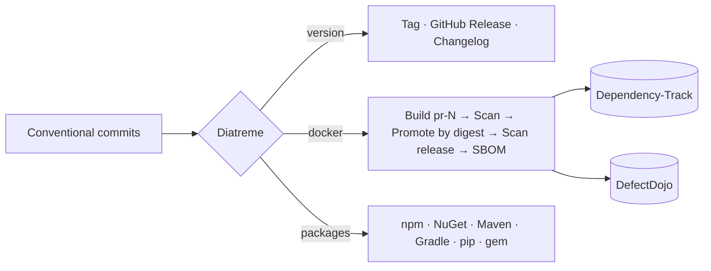

# Diatreme

[](https://github.com/MagmaMoose/diatreme/actions/workflows/ci.yaml)
[](https://github.com/MagmaMoose/diatreme/releases/latest)
[](https://github.com/marketplace/actions/diatreme)
[](https://magmamoose.github.io/diatreme/)
[](LICENSE)

> *One GitHub Action for your whole release spine: versioning, releases, signed commits,
> Docker promotion, and SBOMs, on both GitHub.com and Enterprise.*

Merge a conventional commit and Diatreme computes the semantic version, writes the tag,
GitHub Release and changelog, promotes your already-built Docker image by
provenance-verified retag, and emits a CycloneDX SBOM. The same workflow serves a mixed
stack: python-semantic-release, semantic-release, GitVersion and release-please are all
detected from repository markers, so a whole org shares one release job.

**[Documentation](https://magmamoose.github.io/diatreme/)** ·
[Install the GitHub App](https://github.com/apps/diatreme/installations/new) ·
[Action reference](https://magmamoose.github.io/diatreme/reference/action/) ·
[Marketplace](https://github.com/marketplace/actions/diatreme)

## Quickstart

Production-only release from `main`, using the hosted App token broker:

```yaml
name: Release
on:
  push:
    branches: [main]

jobs:
  release:
    runs-on: ubuntu-latest
    permissions:
      contents: read
      id-token: write     # exchanges GitHub OIDC for a short-lived installation token
    steps:
      - uses: MagmaMoose/diatreme@v2
        with:
          environment: prod
          environments: '["prod"]'
          prerelease-identifiers: '{}'
```

Install the [Diatreme GitHub App](https://github.com/apps/diatreme/installations/new),
add your versioning tool's config, and merge conventional commits. Nothing to register,
no token to rotate.

## What it does

- **Versioning, your way** — auto-detects python-semantic-release, semantic-release,
  GitVersion or release-please from repo markers, so one shared workflow serves a
  mixed-stack org.
- **Releases** — tag, GitHub Release, changelog and normalised outputs, with App-attributed
  **signed** release commits.
- **Docker, promoted not rebuilt** — build `pr-N` images, then promote the *exact scanned
  artifact* to the release tag by digest, verifying provenance first.
- **Supply chain built in** — scan the assembled image on the PR to gate it, then route
  the *released* image's CycloneDX SBOM to Dependency-Track, with optional findings to
  DefectDojo. One project version per release, not one per pull request.
- **Publish anywhere** — npm, NuGet, Maven, Gradle, RubyGems, containers and pip, to
  GitHub Packages or public registries.
- **Multi-environment promotion** — dev → staging → prod with promotion PRs and native
  auto-merge.

> **A wrong `tag-prefix` ships the wrong version, silently.** In a repo releasing several
> packages, nothing errors: the release succeeds and the artifact publishes carrying a
> version computed from another package's history. See
> [Releasing several packages](https://magmamoose.github.io/diatreme/how-to/release-several-packages/).



## Most-used inputs

| Input | Default | What it does |
| --- | --- | --- |
| `mode` | `release` | `ci` builds a PR image · `release` versions and promotes · `enable-auto-merge`. |
| `auth-mode` | `public-app` | Token source. The default uses the hosted App and needs only `id-token: write`. |
| `versioning-tool` | `auto` | Detected from repo markers; override to pin one. |
| `environment` | — | The environment this run releases to. |
| `publish-package` | — | Language package to publish: `npm` · `nuget` · `maven` · `pip` · … |
| `tag-prefix` | — | Scopes the release when one repo ships several packages. |

All 90 inputs and every output →
**[Action reference](https://magmamoose.github.io/diatreme/reference/action/)**

## Documentation

| | |
| --- | --- |
| [Setup](https://magmamoose.github.io/diatreme/setup/) | Install the App, wire the workflow, develop locally |
| [Using the action](https://magmamoose.github.io/diatreme/action/) | Modes, Docker builds, image scanning, signing, publishing packages |
| [Action reference](https://magmamoose.github.io/diatreme/reference/action/) | Every input and output, generated from `action.yml` |
| [Architecture](https://magmamoose.github.io/diatreme/architecture/) · [Broker](https://magmamoose.github.io/diatreme/worker/) | How it works, and the hosted broker behind it |
| [Errors](https://magmamoose.github.io/diatreme/reference/errors/) · [Limits](https://magmamoose.github.io/diatreme/reference/limits/) | What went wrong, and what it will not do |

## Where it sits

**Diatreme** releases · [Tremvok](https://github.com/MagmaMoose/tremvok) deploys and
verifies · [Chargate](https://github.com/MagmaMoose/chargate) gates security ·
[Brimyr](https://github.com/MagmaMoose/brimyr) gates tests

## Versioning

Pin `@v2` for the floating major, or a tag or SHA to freeze.

## Security · Contributing · License

[Report a vulnerability](SECURITY.md) · [Contributing](CONTRIBUTING.md) ·
MIT, see [LICENSE](LICENSE).
