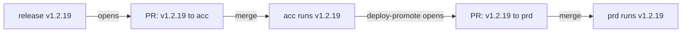

# Deploying through pull requests

<!-- sources: action.yml, scripts/deploy-targets.sh, scripts/open-deploy-pr.sh,
     scripts/promote-deploy-pr.sh, scripts/check-deploy-only-change.sh
     -->

Put every deployment behind a merge. After a release, Diatreme opens a pull
request that moves the image tag in your first kustomize overlay; merging it
deploys, and opens the same change for the next overlay. Nothing reaches a
cluster that nobody merged.

## When you need it

Flux image automation (or Argo CD Image Updater) watches a registry and commits
new tags straight to the branch the cluster reads. That is the right trade for a
development cluster. For acceptance and production it means a release is a
deployment, with no review in between, and "what is running" is whatever the
last automation commit said.

With `deploy-pr-targets` the release still happens on its own, but deploying it
is a pull request per environment, in order:



It works with anything that applies a kustomize overlay from Git: Flux, Argo
CD, or `kubectl apply -k` in a pipeline.

## The overlays

Each overlay is a directory with a `kustomization.yaml` whose `images:` list
names the released images with a `newTag`:

```yaml
# k8s/overlays/acc/kustomization.yaml
resources:
  - ../../base
images:
  - name: containers.example.com/acme/app
    newTag: v1.2.18
```

The entry is matched by `newName` when it has one, otherwise by `name`, against
the repositories the release promoted (`<registry>/<owner>/<image>`, as your bake
file tags them). Diatreme rewrites the value on the `newTag:` line and nothing
else, so comments, ordering and blank lines stay as they are. That includes a
Flux `# {"$imagepolicy": ...}` marker, which is harmless once the automation is
gone and can be removed when convenient.

An overlay is named by its last path segment. The name is part of the deploy PR
branch (`deploy/acc/v1.2.19`), so every overlay in `deploy-pr-targets` needs a
different one.

## The workflow

One job serves all three events: `ci` on an open pull request, `release` on a
push, and `deploy-promote` when a pull request closes. Keeping them in one
workflow keeps `deploy-pr-targets` in one place, and both modes have to agree on
it.

```yaml
name: Release
on:
  push:
    branches: [master, 'hotfix/**']
    # Merging a deploy PR is a deployment, not a release.
    paths-ignore: ['**.md', 'k8s/overlays/acc/**', 'k8s/overlays/prd/**']
  pull_request:
    branches: [master]
    # `closed` is what deploy-promote runs on.
    types: [opened, synchronize, reopened, closed]

jobs:
  diatreme:
    runs-on: ubuntu-latest
    permissions:
      contents: read
      packages: write
      pull-requests: read
      id-token: write   # auth-mode: public-app
    steps:
      - uses: actions/checkout@v4
        with:
          fetch-depth: 0
          fetch-tags: true
      - uses: MagmaMoose/diatreme@v2
        with:
          mode: ${{ github.event_name == 'pull_request' && (github.event.action == 'closed' && 'deploy-promote' || 'ci') || 'release' }}
          deployment-model: bbd
          branch-map: '{"master": "prod", "hotfix/*": "prod"}'
          environments: '["prod"]'
          deploy-pr-targets: '{"prod": ["k8s/overlays/acc", "k8s/overlays/prd"]}'
          # Hotfixes release from their own branch; the cluster reads master.
          deploy-pr-base: master
```

Three lines in it are not optional.

**The App.** A pull request opened with `GITHUB_TOKEN` starts no workflow, so
its required checks never report and it cannot be merged. Use `auth-mode:
public-app` (the default) or `private-app`; the App opens the deploy PR, and
the PR runs your checks like any other.

**`paths-ignore` on push.** Without it, merging the acc PR is a push to
`master`, which cuts a new version, which opens a deploy PR for that version,
and so on for every merge. Diatreme stops that run before it tags anything,
with an error naming the overlays to ignore, but the push trigger is where it
belongs.

**`closed` in the pull request types.** That event is how the next overlay's PR
gets opened. Without it the chain stops after the first overlay.

On a pull request that changes nothing but the overlays, `mode: ci` skips the
image build and scan and reports its check as usual, so a deploy PR costs
seconds rather than a build.

## Turn the image automation off

Diatreme and an image automation writing the same overlay would fight: the
automation commits a tag to the branch, and the open deploy PR goes stale or
conflicts. Remove the automation for every overlay in `deploy-pr-targets` before
the first release that opens a deploy PR. With Flux, that is the
`ImageUpdateAutomation` (and, if nothing else uses them, the `ImagePolicy`) for
those overlays; the `ImageRepository` can stay if development overlays still
use it.

## What happens

1. **A release in `prod`** promotes the images, publishes the GitHub Release,
   and opens `chore(deploy): v1.2.19 to acc` from `deploy/acc/v1.2.19`. The body
   lists each image with the tag it moves from and to.
2. **Someone merges it.** The push is paths-ignored, so no release. The cluster
   applies the overlay.
3. **`deploy-promote`** reads what the merge changed in `acc` (its tags at the
   merge commit against its first parent) and opens
   `chore(deploy): v1.2.19 to prd` with exactly those tags. An image the acc PR
   did not move is not carried along, and a tag a reviewer changed on the
   branch before merging is the one promoted.
4. **Someone merges that.** `prd` is last in its list, so `deploy-promote` has
   nothing more to do.

The commits are made through the GitHub API, so an App's commits are signed,
which a signed-commits rule on the base branch requires.

## One PR per overlay

- **A newer tag supersedes the open PR.** Release `v1.2.20` while the
  `v1.2.19` acc PR is still open, and the older one is closed with a pointer to
  the new one, and its branch deleted.
- **Re-running a release refreshes its PR** rather than opening a second one.
- **An overlay that already runs the tag gets no PR**, and open PRs for older
  tags are closed, since merging them would roll it back.
- **An overlay is never moved backwards.** If `prd` already runs something
  newer (a hotfix merged straight to it, say), no PR is opened for the older
  tag. Nor is one opened while a PR for a newer tag is open.

The deploy branches belong to Diatreme. To change anything else about a
deployment, push to a branch of your own.

## When it stops

| Message | Why | What to do |
| --- | --- | --- |
| `deploy-pr-targets: ...` | The JSON is malformed, names an environment that is not in `environments`, or two overlays share a name. Checked before anything is tagged. | Fix the value. |
| `This push changes nothing but deploy overlays` | A deploy PR was merged into a branch whose push trigger does not ignore the overlays. Nothing was tagged. | Add the overlays to `paths-ignore`. |
| `... has an images[] entry for none of: ...` | The overlay does not name any image the release promoted. | Check the entry's `name` or `newName` against the repositories in the error. |
| `... pins <image> by digest` | A `digest` outranks `newTag` in kustomize, so moving the tag would deploy nothing. | Remove the digest. |
| `... has no newTag to move` | The entry has no `newTag` line to rewrite. | Add `newTag:` to it. |
| `only a block-style 'newTag: <tag>' line is supported` | The entry is in flow style (`{name: ..., newTag: ...}`). | Write it as a block. |

A release that promoted no image (a versioning-only run) opens no deploy PR, and
says so in a warning.

## What it will not do

- **Other repositories.** The overlays are in the repository that releases. A
  separate GitOps repository is not supported yet.
- **Digests, Helm values or raw manifests.** Only a kustomization's
  `images[].newTag`.
- **Deploy without a merge.** There is no auto-merge for deploy PRs: the merge
  is the point. `mode: enable-auto-merge` still works on them if you want it.

## Related

- [Using the action: deploying by pull request](../action.md#deploying-by-pull-request)
- [Promoting a release candidate to stable](promote-a-release-candidate.md), for
  cutting the stable version the deploy PRs then carry
- [Action reference](../reference/action.md): `deploy-pr-targets`,
  `deploy-pr-base`, `deploy-pr-branch-prefix`, `mode: deploy-promote`, and the
  `deploy-pr` output
