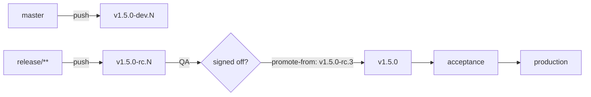

# Promoting a release candidate to stable

<!-- sources: action.yml, scripts/resolve-promote-from.sh,
     scripts/verify-promote-from-images.sh, scripts/push-release-tag.sh
     -->

Release the build that was tested, not a rebuild of it. `promote-from` takes a
prerelease tag and releases that exact image as its stable version: `v1.5.0-rc.3`
becomes `v1.5.0`, same commit, same image.

## When you need it

Where a branch maps to production (`main: prod`), merging is the release and
nothing on this page applies.

It applies where **no branch ever builds a stable version**. A release branch
cuts release candidates, QA signs one of them off, and that candidate is what
ships:



Without `promote-from` the last arrow has no good answer. Under
`deployment-model: bbd` a stable version only comes from a branch mapped to
production, and it is built from a `pr-<N>` image or rebuilt. Under `tbd` a later
environment does retag, but it picks the newest prerelease rather than the one
you name, tags whatever commit the workflow ran on, and rebuilds when the retag
fails.

## The workflow

The simplest setup adds one input to the release workflow you already have, so
the promotion runs with exactly the registry, image and tag settings the
prereleases were cut with:

```yaml
name: Release
on:
  push:
    branches: [master, 'release/**']
  workflow_dispatch:
    inputs:
      promote-from:
        description: 'Prerelease to promote to stable, e.g. v1.5.0-rc.3. Empty for a normal release.'
        required: false
        type: string

jobs:
  release:
    runs-on: ubuntu-latest
    permissions:
      contents: read
      packages: write
      id-token: write
    steps:
      - uses: MagmaMoose/diatreme@v2
        with:
          deployment-model: bbd
          branch-map: '{"master": "dev", "release/*": "staging"}'
          environments: '["dev", "staging", "prod"]'
          prerelease-identifiers: '{"dev": "dev", "staging": "rc"}'
          promote-from: ${{ inputs.promote-from }}
```

Note what is missing from `branch-map`: an entry for `prod`. Nothing pushes its
way to a stable version. The only route there is a dispatch with a tag in the
box.

On a push `inputs.promote-from` is empty and the run is an ordinary release. To
promote, start the workflow by hand (from any branch) and enter the tag.

A separate `promote.yml` works too. Give it the same `tag-prefix`, `registry`,
image and auth inputs as the release workflow, or it will look for the image
somewhere the prerelease never was.

## What a promotion does

1. **Resolves the tag.** It must exist, be a prerelease under `tag-prefix`, and
   carry the identifier of the environment before production (`rc` above).
2. **Checks out the prerelease's commit.** Everything after this reads that
   tree, whichever branch the workflow was started on.
3. **Applies the release guardrails.** A promotion is a production release, so
   `admin-required-from` and `allowed-release-actors` apply as usual.
4. **Asks the registry for the source image**, for every image the repository
   builds. An image the registry reports missing stops the run here, before
   anything is written.
5. **Pushes the stable tag** onto the prerelease's commit. Its message records
   where it came from: `Promoted-From: v1.5.0-rc.3`.
6. **Retags each image** from `<image>:v1.5.0-rc.3` to `<image>:v1.5.0`.
7. **Scans, signs and publishes** as any release does, when those are enabled.
8. **Publishes the GitHub Release**, with notes covering everything since the
   previous stable tag.

`promoted-from` comes back as an output, and the job summary names the
prerelease the release came from.

## What it will not do

**Rebuild.** Every other retag in Diatreme falls back to a fresh build when it
cannot be done. A promotion fails instead, because a fresh build under the
stable tag is precisely the thing being ruled out.

**Move a published version.** If `v1.5.0` already exists and is not this same
promotion, the run stops. That covers a tag on a different commit, a tag an
ordinary release cut, and a tag promoted from another prerelease that happens to
sit on the same commit (`rc.4` after `rc.3` was promoted: same source, but a
separate image). Cut `v1.5.1` instead. If the tag was a mistake, delete it and
its GitHub Release, then promote again.

**Drag `:latest` backwards.** `:latest` moves only when the promoted version is
the highest stable version under `tag-prefix`. Promote a fix on an older release
line (`v1.4.3` once `v1.5.0` is out) and `:latest` stays on `v1.5.0`. GitHub's
own "Latest" marker follows the same rule. A package published by the same run
does not: an npm package still takes the `latest` dist-tag, as it does on any
stable release.

**Build an image some other way.** `publish-package` with
`package-ecosystem: container` runs `docker build` and pushes the result under
the stable version, so it is refused on a promotion. Let Diatreme promote the
image (a `docker-bake.hcl` or a `Dockerfile`) instead. Other ecosystems are
unaffected: a NuGet or npm package is packed from the prerelease's commit with
the stable version, which is the only way a version baked into a package can
change.

**Attest provenance to the wrong commit.** npm provenance and the SLSA
attestation behind `image-sign` both record the commit the *workflow* was
started on. Started from a branch that has moved on, that is not the commit the
artifact was built from. So `npm-provenance` is refused unless the two are the
same commit, and an image is signed but not attested (with a warning). To get
both, start the workflow from the prerelease tag: pick `v1.5.0-rc.3` under
"Use workflow from".

**Write `version-file`.** The artifact is already built, and the run sits on a
tag's commit rather than on a branch it could commit to.

**Deploy.** Diatreme's job ends at the tag, the image and the GitHub Release.
Rolling `v1.5.0` out to acceptance and then production is your deploy tooling's,
typically triggered by the image tag or by `release: published`.

## When it stops

Each of these fails the run before a tag, image or release is written.

| Message | Cause | Fix |
| --- | --- | --- |
| `tag 'v1.5.0-rc.9' does not exist` | A mistyped tag. The message lists the prereleases of that version that do exist. | Use one of them. |
| `is already a stable version` | A stable tag was passed. | Pass the prerelease. |
| `is a 'dev' prerelease, but only 'rc' prereleases are promoted` | The tag is from an earlier channel than the one that feeds production. | Promote the `-rc.N` build. If `dev` really is the last stop before production, say so in `environments` and `prerelease-identifiers`. |
| `v1.5.0 already exists on commit …` | A different build was already released as that version. | Cut a new version. |
| `v1.5.0 was already promoted from v1.5.0-rc.3` | Another prerelease on the same commit was already promoted to that version. | Cut a new version. |
| `was not cut by a promotion` | That version already exists on this commit, from an ordinary release. | Nothing to do: it is released. |
| `cannot be combined with version-override` / `force-bump` | Two instructions for one version. | Remove the other input. |
| `cannot be combined with publish-package and package-ecosystem: container` | That path builds a fresh image. | Promote the image through a bake file or `Dockerfile`, or turn `publish-package` off for the run. |
| `npm-provenance would attest the package to commit …` | The workflow was started on a commit other than the prerelease's. | Start it from the prerelease tag, or turn `npm-provenance` off for the run. |
| `a promotion always releases the stable version, to 'prod'` | `environment` names something other than the last entry of `environments`. | Remove `environment`. |
| `environments is not a JSON array` / `prerelease-identifiers is not a JSON object` | A typo in one of the two inputs. | Fix the JSON. |
| `source image(s) are not in the registry` | The prerelease has a git tag but no image: its build failed, or a retention policy removed it. | Cut a new prerelease and promote that one. |

One failure comes later. If the registry cannot be asked about the source image
(an outage, a credential it rejects), the run carries on rather than blocking on
a guess, and the retag is what finds out: `could not retag <source> as <target>`,
after the stable tag is pushed. Fix the cause and run the promotion again.

## Re-running

A promotion is safe to run again. If a run dies after the stable tag is pushed
(a registry outage during the retag, say), the next run finds `v1.5.0` already
there, reads `Promoted-From: v1.5.0-rc.3` in it, and knows it is looking at its
own unfinished work. It finishes what did not land. Steps that already landed
change nothing: the image is retagged to the same source again, and an existing
GitHub Release is left as it is.

Set `image-skip-existing: true` and a resumed run also skips the images that
already made it.

If the source image is gone for good by then, there is nothing to resume with:
delete the `v1.5.0` tag, cut a new prerelease, and promote that.

## Who may promote

Started by hand, a promotion is a `workflow_dispatch` run targeting the last
environment. By default that requires the actor to be a repository admin, and
the auth token to read Repository: Administration. Two ways to change that:

- `allowed-release-actors` names the people, teams and bots allowed to release,
  without handing them repository admin.
- `admin-required-from: ''` turns the admin check off.

See [Who may cut a release](../action.md#who-may-cut-a-release).

## Related

- [Using the action](../action.md)
- [Action reference](../reference/action.md) for `promote-from` in full.
