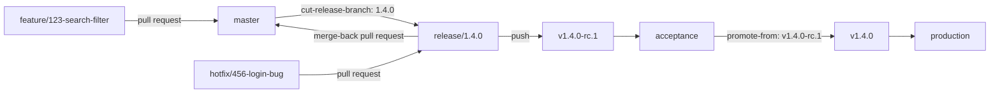

# Releasing from release branches

<!-- sources: action.yml, scripts/cut-release-branch.sh,
     scripts/resolve-release-line-version.sh, scripts/merge-back-release-branch.sh,
     scripts/clean-up-release-branches.sh, scripts/check-branch-naming.sh,
     scripts/resolve-promote-from.sh
     -->

For teams that release on a schedule rather than on every merge. Features reach
the main line through pull requests. When a release is due, the team cuts a
release branch named after the version it chose, the branch's build goes to
acceptance, and once it is signed off that same build goes to production. A
production bug is fixed on the release branch, shipped from it, and merged back
into the main line.



Four pieces of Diatreme carry it, each opt-in:

| Piece | What it does |
| --- | --- |
| `mode: cut-release-branch` | Creates `release/X.Y.Z` from the commit the workflow runs on, after checking the version is new. |
| `release-branch-versioning: branch` | Versions every run on a release branch from the branch name, with no versioning tool. |
| `promote-from` | Releases a signed-off candidate as its stable version, retagging the tested image. |
| `release-branch-merge-back`, `release-branch-cleanup` | After a stable release, open the pull request that merges the release branch back, and delete older release branches that are fully merged. |

## What decides the version

The team does, when it cuts the branch. Nothing is computed from commit
messages, so they do not have to follow Conventional Commits.

| On `release/1.4.0` | Cut as |
| --- | --- |
| The branch is cut | `v1.4.0-rc.1` |
| A fix lands before 1.4.0 ships | `v1.4.0-rc.2` |
| `v1.4.0-rc.2` is promoted | `v1.4.0`, the same image |
| A hotfix lands after 1.4.0 shipped | `v1.4.1-rc.1` |
| A run is repeated on a commit that already holds its candidate | the same candidate, finished rather than cut again |
| A run on a commit already released | nothing |

The branch keeps its name for its whole life: `release/1.4.0` is the 1.4 line,
and its hotfixes ship as 1.4.1, 1.4.2 and so on. A shipped version is never cut
again, because it is a different build from the one now in production.

## The workflows

Three small workflows. Each uses the default `auth-mode: public-app`, so each
job needs `id-token: write` and the
[Diatreme App](https://github.com/apps/diatreme/installations/new) installed.

### Pull requests

Builds the `pr-<N>` image a release later promotes, and holds branch names to
the team's convention:

```yaml
name: CI
on:
  pull_request:
    branches: [master, 'release/**']

jobs:
  ci:
    runs-on: ubuntu-latest
    permissions:
      contents: read
      packages: write
    steps:
      - uses: MagmaMoose/diatreme@v2
        with:
          mode: ci
          branch-name-patterns: |
            feature/{issue}-{name}
            hotfix/{issue}-{name}
```

`{issue}` is a number, `{name}` is lowercase words joined by hyphens, and the
whole name has to match, so `feature/search-filter` and `feature/123_Search`
are refused. Add `deploy/**` if a deploy tool opens pull requests from
`deploy/` branches. Diatreme's own `merge-back/` branches always pass.

### Cut a release

```yaml
name: Cut release
on:
  workflow_dispatch:
    inputs:
      version:
        description: 'Version to release, e.g. 1.4.0'
        required: true

jobs:
  cut:
    runs-on: ubuntu-latest
    permissions:
      contents: read
      id-token: write
    steps:
      - uses: MagmaMoose/diatreme@v2
        with:
          mode: cut-release-branch
          version-override: ${{ inputs.version }}
```

Run it on `master`. It refuses a version that is already released, one that is
not above the newest release, one with a prerelease part (`1.4.0-rc1`: the
branch carries the release number only), and a `release/X.Y.Z` that already
exists on another commit. Nothing else happens in this run. The new branch's
push starts the release workflow below, which cuts the first candidate.

A branch created with `GITHUB_TOKEN` starts no workflow, which is why this
uses the App token. If the release workflow did not start (a `paths-ignore`
on its push trigger can skip a new branch), run it by hand on the release
branch.

### Release

Cuts a candidate on every push to a release branch, and promotes one by hand:

```yaml
name: Release
on:
  push:
    branches: ['release/**']
  workflow_dispatch:
    inputs:
      promote-from:
        description: 'Candidate to release to production, e.g. v1.4.0-rc.2. Empty cuts a candidate from the branch this runs on.'
        required: false

concurrency:
  group: release-${{ github.ref }}
  cancel-in-progress: false

jobs:
  release:
    runs-on: ubuntu-latest
    permissions:
      contents: read
      packages: write
      id-token: write
    steps:
      - uses: MagmaMoose/diatreme@v2
        with:
          deployment-model: bbd
          branch-map: '{"release/*": "acc"}'
          environments: '["acc", "prd"]'
          prerelease-identifiers: '{"acc": "rc"}'
          release-branch-versioning: branch
          promote-from: ${{ inputs.promote-from }}
          release-branch-merge-back: '@default'
          release-branch-cleanup: true
```

- **`concurrency`** keeps two fixes merged in quick succession from racing for
  the same candidate number. A run that loses such a race anyway fails loudly
  instead of leaving its commit without a release.
- **The build happens once.** A candidate's image is the merged pull request's
  `pr-<N>` image when its provenance matches the release commit, otherwise a
  fresh build from the release branch. The promotion retags that image and never
  rebuilds; see [Promoting a release candidate](promote-a-release-candidate.md).
- **Promoting is a production release**, so by default only repository admins
  may start it. To let named people or teams promote without admin rights, set
  `admin-required-from: ''` and list them in `allowed-release-actors`, which
  applies to every trigger. See [Who may cut a release](../action.md#who-may-cut-a-release).

## Hotfixes

1. Branch `hotfix/456-login-bug` from the release branch production runs, and
   open the pull request against that release branch.
2. Merging it cuts the next candidate (`v1.4.1-rc.1` once 1.4.0 shipped), which
   goes to acceptance.
3. Promote it: `promote-from: v1.4.1-rc.1`.
4. The promotion opens a pull request merging the release branch into `master`.
   Review it and merge it **with a merge commit**, so `master` carries the
   fix's own commits and every later release contains it.

The merge-back pull request comes from `merge-back/release-1.4.0`, a branch
that starts at the release branch's head. It never comes from the release
branch itself: "Update branch" and conflict resolution on a pull request commit
the target into its head branch, which would put unreleased work from `master`
into the next hotfix. Resolve conflicts on the merge-back branch. A later fix
released from the same line moves that branch forward and reuses the pull
request.

A release with no hotfix has nothing to merge back, and gets no pull request.

## Cleaning up, and patching an old line

`release-branch-cleanup: true` deletes, after each stable release, the release
branches of older lines whose head `master` already contains. Promoting 1.5.0
removes `release/1.4.0` once its hotfixes are merged back. A line with an
unmerged fix is kept, with a notice naming it.

What a deleted line shipped stays reachable through its tags. To patch it, run
**Cut release** on the line's latest tag (**Use workflow from** → `v1.4.2`) with
the line's version (`1.4.0`). That reopens `release/1.4.0` at the shipped
commit, and the next fix merged into it is cut as `v1.4.3-rc.1`.

## Rules worth adding

These belong to the repository, not to Diatreme, and make the flow hard to get
wrong:

- **`release/**`**: restrict branch creation to the Diatreme App, so a release
  branch only ever comes from **Cut release**; require pull requests; block
  force pushes. Let the App bypass deletion if you turn on cleanup.
- **`master`**: require pull requests, and keep **Allow merge commits** on in
  the repository settings. The merge-back needs it. Diatreme warns, in the log
  and in the pull request, when it is off.

## What it will not do

**Deploy.** Diatreme's job ends at the tag, the image and the GitHub Release.
Deploy each candidate to acceptance and each promoted version to production
with your deploy tooling, typically triggered by `release: published`. With
[Tremvok](https://github.com/MagmaMoose/tremvok), `gitops-pr` opens those deploy
pull requests.

**Cherry-pick.** A fix reaches `master` through the merge-back pull request,
never as a copy.

**Merge the merge-back pull request.** A person reviews and merges it.

**Version a branch without a version in its name.** `release/next` or `test`
is left to the configured versioning tool, so a shared integration branch keeps
working as it did.

## Related

- [Promoting a release candidate](promote-a-release-candidate.md)
- [Using the action](../action.md)
- [Action reference](../reference/action.md) for every input named here.
