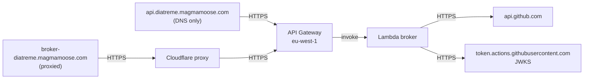

# Deployment

<!-- sources: .github/workflows/deploy-worker.yaml, .github/workflows/release.yaml,
     .github/workflows/docs.yml, .github/workflows/broker-smoke-aws.yml,
     worker/wrangler.jsonc
     -->

Three things ship out of this repository on their own schedules: the composite
action, the broker, and this site.

## What serves the broker today

The two broker hostnames both answer from AWS Lambda behind API Gateway in
`eu-west-1`.



`api.diatreme.magmamoose.com` is the default `token-broker-url` frozen into every
published version of the action, so it carries the consumer traffic. It resolves
straight to the API Gateway custom domain with no proxy in front.
`broker-diatreme.magmamoose.com` is the shipped fallback and reaches the same
gateway through the Cloudflare proxy.

Confirm which is which at any time:

```bash
dig +short api.diatreme.magmamoose.com CNAME
dig +short broker-diatreme.magmamoose.com
```

!!! warning "Editing `worker/` does not change production"
    Both broker hostnames answer from AWS Lambda running the Python broker
    implementation in `broker/`. The TypeScript Cloudflare Worker (`worker/`)
    remains in the repository as the rollback target, but it is not what
    consumers hit. See [Architecture](../architecture.md) for more.

### Rolling back to Cloudflare

The Cloudflare Worker stays deployed and configured precisely so the hostnames
can be pointed back at it. Rollback is a DNS change plus a Cloudflare route, not
a redeploy. Verify with the smoke workflow below before and after.

## Deploying the broker (Cloudflare)

`deploy-worker.yaml` runs on every push to `main` touching `worker/**` or the
workflow itself. It installs, runs `npm run check` (typecheck, tests, and a
wrangler dry run), injects the KV namespace IDs, then deploys.

Required repository secrets:

| Secret | Purpose |
| --- | --- |
| `CLOUDFLARE_API_TOKEN` | Wrangler auth. |
| `CLOUDFLARE_ACCOUNT_ID` | Target account. |

Optional repository variables:

| Variable | Purpose |
| --- | --- |
| `DIATREME_JWKS_CACHE_ID` | KV namespace holding last-known-good JWKS snapshots. |
| `COPILOT_QUOTA_KV_ID` | KV namespace caching the `/releases` aggregate. |

The injection step is skipped when both are empty, and the deploy still
succeeds. Namespace IDs are injected rather than committed so a self-hoster
never inherits someone else's namespace.

!!! warning "A deleted namespace fails the deploy, not the request"
    If one of those variables points at a namespace that no longer exists, every
    deploy fails at the wrangler step while the running broker keeps serving.
    The symptom is that merges stop reaching production with nothing obviously
    broken. Check the workflow's history, not the broker's logs.

Deploy by hand from a working tree:

```bash
cd worker
npm ci
npm run check
wrangler deploy
```

Secrets are set once per environment and are not in the repository:

```bash
wrangler secret put GITHUB_APP_ID
wrangler secret put GITHUB_APP_PRIVATE_KEY
wrangler secret put PROCESS_TRIGGER_SECRET
```

Every variable is described in [Configuration](../reference/configuration.md).

### Public entry points are off on purpose

`workers_dev` and `preview_urls` are both `false` in `worker/wrangler.jsonc`.
Each would be a publicly reachable door to a live token minter, inheriting
production secrets and sitting outside whatever rules are bound to the custom
domain. Leave them off.

## Verifying the broker end to end

Synthetic probes prove routing and the error ladder, but they can only ever be
rejected, so they can't prove the thing that matters: that a genuine Actions
OIDC token comes back as a usable installation token. Only a real runner can
mint one.

`broker-smoke-aws.yml` does that. It runs Mondays at 06:00 UTC and on demand.
For each hostname it mints a real OIDC token, exchanges it, then uses the
returned token against the GitHub API and asserts it authenticates as the
expected repository.

Run it on demand:

```bash
gh workflow run broker-smoke-aws.yml
```

A failure means an expired App key, a revoked installation, or an IAM, SSM or
routing change. It costs one Lambda invocation and two API calls a week.

## Releasing the action

`release.yaml` dogfoods the action against itself with `uses: ./`, then
force-updates the floating major tag once semantic-release publishes a stable
version. Consumers pin `@v2`, a full tag like `@v2.4.6`, or a SHA.

Because consumers pin by SHA, action input names, defaults, behaviour, and the
broker's wire responses are frozen. Changing one breaks repositories whose
maintainers cannot be reached. Treat both as append-only.

## Publishing this site

`docs.yml` builds with `mkdocs build --strict` and deploys to Cloudflare Workers
on every push to `main` touching `docs/**` or `mkdocs.yml`.

Build it locally first:

```bash
pip install -r docs/requirements.txt
mkdocs build --strict
```

Strict mode fails on broken internal links, which is what the published build
enforces too.

## Related

- [Configuration](../reference/configuration.md)
- [Errors](../reference/errors.md)
- [Architecture](../architecture.md)
